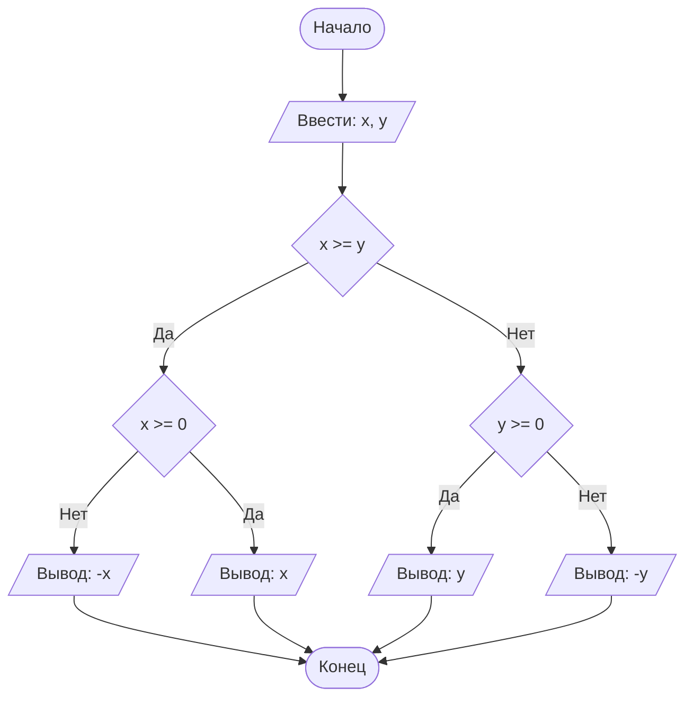

# 1labwork-

```mermaid
graph TD
    A([Начало]) --> B[/Ввести: x, y/]
    B --> C{x >= y}
    C -- Нет --> D{y >= 0}
    D -- Нет --> E[/Вывод: -y/]
    D -- Да --> H[/Вывод: y/]
    C -- Да --> I{x >= 0}
    I -- Нет --> J[/Вывод: -x/]
    I -- Да --> K[/Вывод: x/]
    J --> Z
    K --> Z
    H --> Z
    E --> Z([Конец])

```
