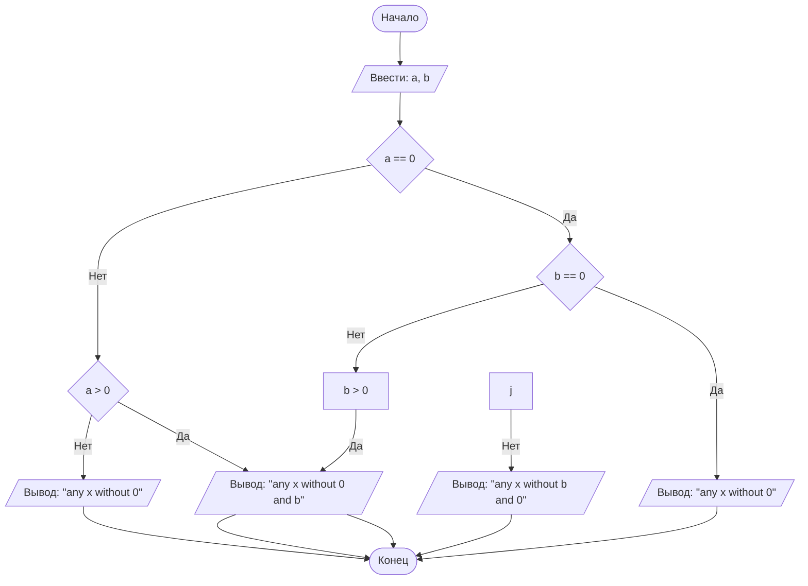

# 1labwork-

```mermaid
graph TD
    A([Начало]) --> B[/Ввести: a, b/]
    B --> C{a == 0}
    C -- Нет --> D{a > 0}
    D -- Нет --> E[/Вывод: "any x without 0"/]
    D -- Да --> H[/Вывод: y/]
    C -- Да --> I{b == 0}
    I -- Нет --> J[b > 0]
    I -- Да --> K[/Вывод: "any x without 0"/]
    J -- Да --> H[/Вывод: "any x without 0 and b"/]
    j -- Нет --> V[/Вывод: "any x without b and 0"/]
    V --> Z
    H --> Z
    K --> Z
    H --> Z
    E --> Z([Конец])

```
