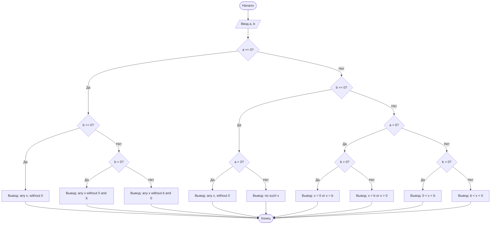

# 1labwork-

```mermaid
graph TD
    A([Начало]) --> B[/Ввод a, b/]
    B --> C{a == 0?}
    C -- Да --> D{b == 0?}
    D -- Да --> E["Вывод: any x, without 0"]
    D -- Нет --> F{b > 0?}
    F -- Да --> G["Вывод: any x without 0 and b"]
    F -- Нет --> H["Вывод: any x without b and 0"]
    C -- Нет --> I{b == 0?}
    I -- Да --> J{a > 0?}
    J -- Да --> K["Вывод: any x, without 0"]
    J -- Нет --> L["Вывод: no such x"]
    I -- Нет --> M{a > 0?}
    M -- Да --> N{b > 0?}
    N -- Да --> O["Вывод: x < 0 or x > b"]
    N -- Нет --> P["Вывод: x < b or x > 0"]
    M -- Нет --> Q{b > 0?}
    Q -- Да --> R["Вывод: 0 < x < b"]
    Q -- Нет --> S["Вывод: b < x < 0"]
    E --> T([Конец])
    G --> T
    H --> T
    K --> T
    L --> T
    O --> T
    P --> T
    R --> T
    S --> T


```
